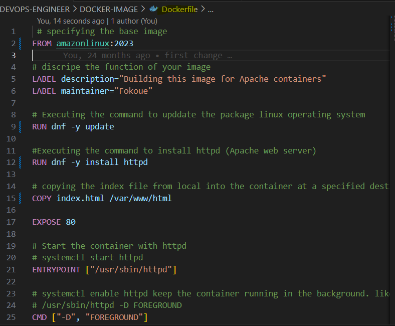
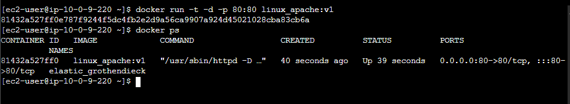
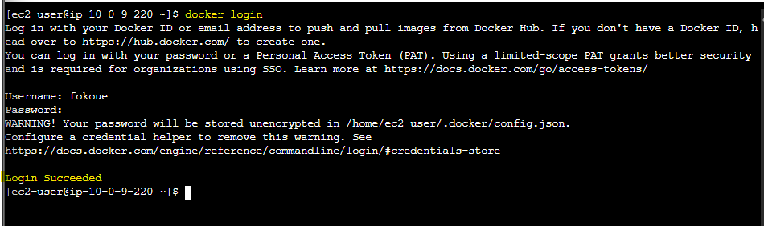

# 🐳 Dockerized Web Application 
This project demonstrates how to package and deploy a web application using Docker for consistent and reliable deployment across any operating system.


🚀 Project Overview

Developer Stage:
The developer creates the application (e.g., index.html) along with its dependencies.

Packaging Stage:
The app and its dependencies are packaged together in a Docker image, ensuring everything needed to run the application is included.

Deployment Stage:
Using Docker, the packaged application can be shipped and deployed to production, regardless of the underlying operating system or environment.

🧩 Key Features

Simplifies app deployment using containerization

Ensures consistent environments from development to production

Eliminates “works on my machine” issues

Easily portable across OS platforms

🛠️ Technologies Used

Docker

HTML/CSS/JavaScript (example static web app)

Linux base image (amazonlinux:2023/CentOS/Alpine/Ubuntu)

# STEPS BY STEPS PROCESS 

### 1. Launched amazon linux server:


### 2. Installed docker in linux server:
- Take up you privilage. the first command for ubuntu and the second for linux. 
```
sudo su - ubuntu
```
```
sudo su - ec2-user
```
- let verifie if docker is install 
```
 docker --version
```
- After the verification we notice docker is not install. So we need to go to the officail documentation [this page](https://docs.aws.amazon.com/serverless-application-model/latest/developerguide/install-docker.html) depending on our OS we follow the steps and install. For us is Installing Docker on Linux 
#### 1. Update the installed packages and package cache on your instance.
```
 sudo yum update -y
```
#### 2. Install the most recent Docker Community Edition package
```
 sudo yum install -y docker
```
#### 3. Start the Docker service.
```
 sudo service docker start
```
#### 4. Add the ec2-user to the docker group so that you can run Docker commands without using sudo.
```
 sudo usermod -a -G docker ec2-user
```
#### 5. This command keep our docker up at all time. No matter if our instance is stop docker will still be active in this server. 
```
 sudo systemctl enable docker
```
#### 6. Verify that the ec2-user can run Docker commands without using sudo.

```
 docker ps
```


### 3. Run our first container hello-word
```
 docker run hello-world

```
- Then verify our conatainer with  
```
 docker ps
```
#### Nothing is been showing after runing the command docker ps because container a effermero. So we need to use the command below to be able to see or specified the port to keep the conatiner up at all time
```
 docker ps -a
```


### 4. We need to write our Dockefile that will be use to build our docker image. 
- The file have been created and must always have the name "Dockerfile"


- Then we place the dockerfile created in our linux server 
```
 vim Dockerfile
```
```
 cat Dockerfile
```
#### When you run the "vim" command above first thing to do is to press the "i" for insert. Then past your 'Dckerfile content" press the botton "Esc" ":wq!"


- We repite the step up for our index.html 
```
 vim index.html
```
```
 cat index.html
```


### 5. After writing and placing our Dockerfile in our linux-server let use the syntax below that will allow us to build an image based on our Dockerfile

```
 docker build -t linux_apache:v1 .
```
```
 docker images
```


### 6. Here we are going to create a container base on our "image" and start that container 
#### We are running and application that is inside the conatainer, we are not directly running the application reason for us to create a port were we can asses our application externaly. "The port need to be outside and inside of the container. So we use "-p(for port) the first 80(for inside) and the other 80(for outside)". Using the "-d" is to make your conatiner run on ditache mood 
```
 docker run -t -d -p 80:80 linux_apache:v1
```


### 7. View the docker container on the website using the public ip of our linux-server


### 8. Now let share our docker image to Docker Hub 
- First thing we need to login into our docker hub account with our user name and password. 
```
 docker login
```


- We need to tag our image so that we can place it in our Docker Hub account. We tag the image with the image_id of that image we want to send to our account.  
```
 docker images
```
```
 docker tag image_id fokoue/linux_apache:v1
```


- Let publish(push) the image to our repository   
```
 docker push image_id fokoue/linux_apache:v1
```


- Let view the push in our Docker Hub    


### 9. If you want to use this image just type the command below 
```
 docker pull fokoue/linux_apache:v1
```
```
 docker run -t -d -p 80:80 linux_apache:v1
```
#### After this use your public IP to view the contain of that image

## Author
FOKOUE THOMAS